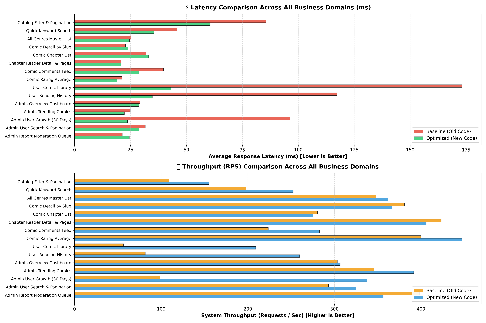

# 📚 HComic - Backend REST API (Comic Reader Platform)

<p align="center">
  
  
  
  
  
  
  
  
</p>

> A Backend RESTful API for an online comic reader platform. Built with **Spring Boot 4** and **Java 21**. It features **JWT Access & Refresh Token authentication**, **Role-Based Access Control (RBAC)**, automatic image compression to **WebP**, database query optimization (solving **N+1 queries**), database versioning with **Flyway**, and **Docker & CI/CD** setup.

---

## 📑 Table of Contents
- [🚀 Key Highlights](#-key-highlights)
- [🛠️ Tech Stack](#️-tech-stack)
- [📊 Performance Optimization & Benchmark](#-performance-optimization--benchmark)
- [🌟 Core Features](#-core-features)
- [🏗️ Project Structure](#️-project-structure)
- [🗄️ Database Migrations (Flyway)](#️-database-migrations-flyway)
- [📖 API Reference & Documentation (Swagger)](#-api-reference--documentation-swagger)
- [⚡ Quick Start](#-quick-start)
- [👥 Test Accounts](#-test-accounts)
- [🧪 Testing & CI/CD](#-testing--cicd)

---

## 🚀 Key Highlights

- 🔒 **Dual-Token Authentication & RBAC**: Login system with Access Tokens (30 minutes) and Refresh Tokens (7 days) saved in the database. Supports token revocation (logout) and role permissions (`ROLE_ADMIN`, `ROLE_TRANSLATOR`, `ROLE_USER`).
- 🖼️ **Automatic WebP Image Pipeline**: Automatically converts and compresses uploaded cover images and chapter pages (JPG/PNG/GIF) to **WebP (Quality 80%)**. This reduces image file size by **30% - 50%** and saves bandwidth.
- ⚡ **Database & Query Optimization**:
  - Solved **N+1 query problems** using Spring Data `@EntityGraph` and Hibernate Batch Fetching (`hibernate.default_batch_fetch_size=50`).
  - Replaced in-memory loops with **Native SQL Aggregations** (`GROUP BY DATE`).
  - Added Composite Database Indexes for search, reading history, and reports.
- 📈 **Benchmark Results**: Improved throughput (RPS) up to **3.70x** and reduced response latency by up to **-75.4%**.
- 🔄 **Flyway Database Versioning**: Automatically manages database tables and schema migrations from `V1` to `V8`.
- 🐳 **Docker Support**: Multi-stage Docker build with Eclipse Temurin JRE 21 and Spring Boot LayerTools, combined with `compose.yaml` (with PostgreSQL 17 health check).
- 🤖 **CI/CD Automation**: GitHub Actions runs 22 unit tests on pull requests to `develop` and builds & pushes Docker images to Docker Hub on merge to `main`.

---

## 🛠️ Tech Stack

| Category | Technology / Library | Version | Description |
| :--- | :--- | :--- | :--- |
| **Language** | Java | 21 (LTS) | Eclipse Temurin OpenJDK 21 |
| **Framework** | Spring Boot | 4.1.0 | Web, Data JPA, Security, Validation |
| **Database** | PostgreSQL | 17 | Main Relational Database |
| **In-Memory DB** | H2 Database | Latest | Used for unit testing |
| **Migration** | Flyway | Latest | Database schema version control |
| **Authentication** | JJWT (Java JWT) | 0.12.6 | JWT Access & Refresh Token creation/validation |
| **Image Processing** | Sejda WebP ImageIO | 0.1.6 | Automatic WebP image conversion |
| **Mapping & Tools** | MapStruct & Lombok | 1.6.3 / 1.18.46 | DTO mapping and boilerplate reduction |
| **API Docs** | SpringDoc OpenAPI (Swagger UI) | 2.8.5 | Interactive API documentation |
| **Container** | Docker & Docker Compose | Latest | Multi-stage build and service orchestration |
| **CI/CD** | GitHub Actions | Latest | Automated testing and Docker deployment |

---

## 📊 Performance Optimization & Benchmark

The system was tested with load test scenarios: **10 concurrent workers / 50 requests per test**.

### 📈 Metrics Comparison Table (Before vs. After Optimization)

| Business Domain | Scenario / API Endpoint | Baseline Latency | Optimized Latency | Latency Reduction | Baseline RPS | Optimized RPS | Throughput Change |
| :--- | :--- | :--- | :--- | :--- | :--- | :--- | :--- |
| **1. Catalog & Discovery** | Catalog Filter & Pagination | 85.61 ms | 60.67 ms | **-29.1%** | 109.0 req/s | 155.2 req/s | **1.42x** |
| **1. Catalog & Discovery** | Quick Keyword Search | 45.75 ms | 35.44 ms | **-22.5%** | 197.8 req/s | 252.6 req/s | **1.28x** |
| **3. Community & Comments** | Comic Comments Feed | 39.77 ms | 28.65 ms | **-28.0%** | 223.7 req/s | 282.7 req/s | **1.26x** |
| **3. Community & Ratings** | Comic Rating Average | 21.26 ms | 18.87 ms | **-11.2%** | 399.6 req/s | 447.0 req/s | **1.12x** |
| **4. Library & Tracking** | User Comic Library | 173.05 ms | 43.16 ms | **-75.1%** | 56.4 req/s | 209.0 req/s | **3.70x** |
| **4. Library & Tracking** | User Reading History | 117.31 ms | 34.79 ms | **-70.3%** | 81.8 req/s | 259.8 req/s | **3.17x** |
| **5. Admin & Analytics** | Admin Trending Comics | 24.94 ms | 22.29 ms | **-10.6%** | 345.6 req/s | 391.4 req/s | **1.13x** |
| **5. Admin & Analytics** | Admin User Growth (30 Days) | 96.30 ms | 23.70 ms | **-75.4%** | 98.5 req/s | 337.7 req/s | **3.43x** |
| **5. Admin & Analytics** | Admin User Search & Pagination | 31.67 ms | 28.84 ms | **-8.9%** | 293.2 req/s | 325.1 req/s | **1.11x** |

### 📊 Visual Benchmark Chart



*The chart shows two parts: the top chart compares **Response Latency** in ms (shorter/green is better), and the bottom chart compares **Throughput (RPS)** (longer/green is better). The biggest improvements are in **User Comic Library** (3.70x faster), **Reading History** (3.17x faster), and **User Growth Analytics** (3.43x faster) after fixing N+1 queries and optimizing SQL aggregates.*

> **Key Optimization Techniques:**
> 1. **User Growth Analytics**: Changed from loading all users into memory to a single Native SQL query `COUNT(*) ... GROUP BY DATE(created_at)`.
> 2. **Fixed N+1 Queries in Library & History**: Used Spring Data `@EntityGraph(attributePaths = {"comic", "user"})` and batch fetching.
> 3. **Database Indexing**: Added composite indexes on frequently used columns (`users.created_at`, `users(role, is_banned)`, `reports(status, created_at)`).
>
> 💡 *Note: The benchmark was conducted in a local development environment using Python scripts generated with the assistance of the **Antigravity AI Agent**.*

---

## 🌟 Core Features

### 1. 🔐 Authentication & Users
- Register new users and login with `BCrypt` password hashing.
- Issue dual tokens: **Access Token** (JWT) and **Refresh Token** (in database).
- Refresh token endpoint and logout with token revocation.
- Role-based access control (RBAC): `ROLE_ADMIN`, `ROLE_TRANSLATOR`, `ROLE_USER`.

### 2. 📖 Comic & Chapter Management
- CRUD operations for Comics: title, description, author, status (`ONGOING`, `COMPLETED`, `HIATUS`), genres.
- Automatically creates clean SEO `slug` for Comics and Chapters.
- Upload multiple chapter images at once (Multipart Upload) with automatic conversion to **WebP**.
- View chapter details with image page URLs.

### 3. 🔍 Search & Catalog Filter
- **Quick Search**: Fast comic title search by keyword.
- **Catalog Filter**: Filter comics by multiple genres, status, uploader, and sort by views, rating, or update date.
- Genre management system (CRUD for genres).

### 4. 💬 Community & Interaction
- **Like / Unlike**: Like comics and update total like counts.
- **Rating System**: Rate comics (1 - 5 stars) and calculate the average score.
- **Comments**: Comment on a comic series or directly on a specific chapter.
- **Report System**: Users can submit reports for inappropriate comments, chapters, or comics.

### 5. 📚 Library & Reading Tracker
- **User Library**: Save comics into personal shelf categories (`READING`, `COMPLETED`, `PLAN_TO_READ`, `ON_HOLD`, `DROPPED`).
- **Reading History**: Automatically save reading progress (last chapter, page number, timestamp).
- **Page Bookmarks**: Bookmark favorite pages inside chapters.

### 6. 🛡️ Admin Dashboard & Moderation
- **System Overview**: Summary statistics for total users, comics, chapters, comments, and views.
- **30-Day User Growth**: Daily new user registrations via SQL aggregation.
- **Trending Comics**: View most read and highly rated comics.
- **User Moderation**: Search user accounts, Ban or Unban users.
- **Report Queue**: View submitted reports and mark them as Resolved or Rejected.

---

## 🏗️ Project Structure

The project follows a standard Layered Architecture:

```
d:\projects\Hcomic
├── .github/
│   └── workflows/
│       ├── test.yml                 # CI: Runs unit tests on pull requests (develop)
│       └── deloy-docker-hub.yml     # CD: Builds & pushes Docker image to Docker Hub (main)
├── docs/
│   └── images/
│       └── benchmark_comparison.png # Benchmark performance comparison chart
├── src/
│   ├── main/
│   │   ├── java/com/comic/h/
│   │   │   ├── config/              # Security, OpenAPI, WebMvc configurations
│   │   │   ├── controller/          # 16 REST API Controllers
│   │   │   ├── dto/                 # Request & Response Data Transfer Objects
│   │   │   ├── entity/              # JPA Entities (User, Comic, Chapter, Comment, ...)
│   │   │   ├── enums/               # Enums (Role, ComicStatus, ShelfStatus, ReportReason, ...)
│   │   │   ├── exception/           # Global Exception Handler & Custom Exceptions
│   │   │   ├── mapper/              # MapStruct Interfaces
│   │   │   ├── repository/          # Spring Data JPA Repositories with custom queries
│   │   │   ├── security/            # JWT Filter, Token Provider, UserDetailsService
│   │   │   └── service/             # Business Logic Interfaces & Implementations
│   │   └── resources/
│   │       ├── application.properties
│   │       └── db/migration/        # Flyway SQL Migrations (V1 -> V8)
│   └── test/
│       └── java/com/comic/h/        # Unit Tests for Auth, Comic, and Comment services
├── compose.yaml                     # Docker Compose Setup (Backend API + PostgreSQL 17)
├── Dockerfile                       # Multi-stage Docker Build
├── pom.xml                          # Maven configuration & dependencies
└── README.md
```

---

## 🗄️ Database Migrations (Flyway)

Database tables and updates are managed with Flyway migrations:

| Migration File | Description |
| :--- | :--- |
| `V1__init_schema.sql` | Creates initial tables: `users`, `comics`, `chapters`, `chapter_images`, `comic_likes`, `comic_rates`, `comments` |
| `V2__add_upload_status_to_chapters.sql` | Adds upload status field to chapters |
| `V3__add_reading_history_library_and_bookmarks.sql` | Creates `user_comic_library`, `reading_histories`, and `page_bookmarks` tables |
| `V4__add_reports_and_user_ban_fields.sql` | Creates `reports` table and adds `is_banned`, `banned_at` fields to `users` |
| `V5__create_refresh_tokens_table.sql` | Creates `refresh_tokens` table for session management |
| `V6__add_genres_system.sql` | Creates `genres` and `comic_genres` tables with default seed genres |
| `V7__add_search_indexes.sql` | Adds database indexes for keyword search and filtering |
| `V8__optimize_indexes.sql` | Adds composite indexes on `users`, `reports`, and `reading_histories` |

---

## 📖 API Reference & Documentation (Swagger)

Swagger UI documentation is available at:

👉 **[http://localhost:8080/swagger-ui.html](http://localhost:8080/swagger-ui.html)**

### 🔑 How to test protected endpoints:
1. Send a request to `POST /api/auth/login` with user credentials to get an `accessToken`.
2. Click the **Authorize** button on the top right in Swagger UI.
3. Paste the `accessToken` and click **Authorize** ➔ **Close**.
4. You can now test protected API endpoints directly.

### 📋 Overview of Main Endpoints

<details>
<summary><b>1. Authentication & Session (/api/auth)</b> - Click to expand</summary>

| Method | Endpoint | Required Role | Description |
| :--- | :--- | :--- | :--- |
| `POST` | `/api/auth/register` | Public | Register a new user account |
| `POST` | `/api/auth/login` | Public | Login and receive Access Token & Refresh Token |
| `POST` | `/api/auth/refresh` | Public | Get a new Access Token using Refresh Token |
| `POST` | `/api/auth/logout` | Authenticated | Logout and invalidate Refresh Token |

</details>

<details>
<summary><b>2. Comics (/api/comics)</b> - Click to expand</summary>

| Method | Endpoint | Required Role | Description |
| :--- | :--- | :--- | :--- |
| `GET` | `/api/comics` | Public | Get list of comics with search, filter, and pagination |
| `GET` | `/api/comics/quick-search` | Public | Quick search comics by keyword |
| `GET` | `/api/comics/{id}` | Public | Get comic details by ID |
| `GET` | `/api/comics/slug/{slug}` | Public | Get comic details by slug |
| `GET` | `/api/comics/my-comics` | `TRANSLATOR`, `ADMIN` | Get comics uploaded by current user |
| `GET` | `/api/comics/uploader/{uploader}` | Public | Get comics by uploader username |
| `POST` | `/api/comics` | `TRANSLATOR`, `ADMIN` | Create a new comic (with cover image upload) |
| `PUT` | `/api/comics/{id}` | `TRANSLATOR`, `ADMIN` | Update comic information and cover image |
| `DELETE`| `/api/comics/{id}` | `TRANSLATOR`, `ADMIN` | Delete a comic |

</details>

<details>
<summary><b>3. Chapters & Reader Images (/api/chapters, /api/chapters/{id}/images)</b> - Click to expand</summary>

| Method | Endpoint | Required Role | Description |
| :--- | :--- | :--- | :--- |
| `GET` | `/api/comics/{comicId}/chapters` | Public | Get all chapters of a comic |
| `GET` | `/api/chapters/{id}` | Public | Get chapter details |
| `GET` | `/api/chapters/slug/{comicSlug}/{chapterSlug}` | Public | Get chapter details by slugs |
| `POST` | `/api/comics/{comicId}/chapters` | `TRANSLATOR`, `ADMIN` | Create a new chapter |
| `PUT` | `/api/chapters/{id}` | `TRANSLATOR`, `ADMIN` | Update chapter details |
| `DELETE`| `/api/chapters/{id}` | `TRANSLATOR`, `ADMIN` | Delete a chapter |
| `GET` | `/api/chapters/{chapterId}/images` | Public | Get list of image URLs for a chapter |
| `POST` | `/api/chapters/{chapterId}/images` | `TRANSLATOR`, `ADMIN` | Upload chapter pages (auto WebP conversion) |
| `DELETE`| `/api/chapters/{chapterId}/images/{id}` | `TRANSLATOR`, `ADMIN` | Delete a specific chapter image |

</details>

<details>
<summary><b>4. Genres (/api/genres)</b> - Click to expand</summary>

| Method | Endpoint | Required Role | Description |
| :--- | :--- | :--- | :--- |
| `GET` | `/api/genres` | Public | Get all genres |
| `GET` | `/api/genres/{slug}` | Public | Get genre details by slug |
| `POST` | `/api/genres` | `ADMIN` | Create a new genre |
| `PUT` | `/api/genres/{id}` | `ADMIN` | Update a genre |
| `DELETE`| `/api/genres/{id}` | `ADMIN` | Delete a genre |

</details>

<details>
<summary><b>5. Likes, Ratings & Comments (/api/comics/{id}/like, /rate, /comments)</b> - Click to expand</summary>

| Method | Endpoint | Required Role | Description |
| :--- | :--- | :--- | :--- |
| `POST` | `/api/comics/{comicId}/like` | Authenticated | Like or unlike a comic |
| `GET` | `/api/comics/{comicId}/like/status`| Authenticated | Check if current user liked the comic |
| `POST` | `/api/comics/{comicId}/rate` | Authenticated | Rate a comic (1 - 5 stars) |
| `GET` | `/api/comics/{comicId}/rate/my-rating` | Authenticated | Get current user rating for a comic |
| `GET` | `/api/comics/{comicId}/rate/average` | Public | Get average rating score and total votes |
| `GET` | `/api/comments/comic/{comicId}` | Public | Get comments for a comic |
| `GET` | `/api/comments/chapter/{chapterId}` | Public | Get comments for a specific chapter |
| `POST` | `/api/comments` | Authenticated | Post a new comment |
| `DELETE`| `/api/comments/{id}` | Authenticated | Delete own comment (or by Admin) |

</details>

<details>
<summary><b>6. Library, History & Bookmarks (/api/library, /reading-history, /bookmarks)</b> - Click to expand</summary>

| Method | Endpoint | Required Role | Description |
| :--- | :--- | :--- | :--- |
| `GET` | `/api/library` | Authenticated | Get comics in user library by shelf status |
| `POST` | `/api/library` | Authenticated | Add or update comic shelf status |
| `DELETE`| `/api/library/{comicId}` | Authenticated | Remove comic from user library |
| `GET` | `/api/reading-history` | Authenticated | Get user reading history |
| `POST` | `/api/reading-history` | Authenticated | Save reading progress (chapter & page) |
| `DELETE`| `/api/reading-history/all` | Authenticated | Clear all reading history |
| `GET` | `/api/bookmarks` | Authenticated | Get list of bookmarked pages |
| `POST` | `/api/bookmarks` | Authenticated | Bookmark a page in a chapter |
| `DELETE`| `/api/bookmarks/{id}` | Authenticated | Delete a bookmark |

</details>

<details>
<summary><b>7. Admin & Moderation (/api/admin, /api/reports)</b> - Click to expand</summary>

| Method | Endpoint | Required Role | Description |
| :--- | :--- | :--- | :--- |
| `POST` | `/api/reports` | Authenticated | Submit an issue or content report |
| `GET` | `/api/admin/analytics/overview` | `ADMIN` | Get total users, comics, chapters, comments, and views |
| `GET` | `/api/admin/analytics/trending-comics` | `ADMIN` | Get list of trending comics |
| `GET` | `/api/admin/analytics/user-growth` | `ADMIN` | Get user registration growth over the last 30 days |
| `GET` | `/api/admin/users` | `ADMIN` | Search and paginate user accounts |
| `PUT` | `/api/admin/users/{userId}/ban` | `ADMIN` | Ban a user account |
| `PUT` | `/api/admin/users/{userId}/unban` | `ADMIN` | Unban a user account |
| `GET` | `/api/admin/reports` | `ADMIN` | Get report moderation queue |
| `PUT` | `/api/admin/reports/{reportId}/resolve` | `ADMIN` | Mark report as resolved |
| `PUT` | `/api/admin/reports/{reportId}/reject` | `ADMIN` | Reject a report |

</details>

---

## ⚡ Quick Start

### Prerequisites
- **Docker & Docker Compose** (Recommended), or:
- **JDK 21** (Eclipse Temurin or OpenJDK)
- **Maven 3.9+** (or use the included `./mvnw` wrapper)
- **PostgreSQL 17** (if running locally without Docker)

---

### Option 1: Run with Docker Compose (Recommended)

Start Backend API and PostgreSQL 17 database with one command:

```bash
docker compose up --build -d
```

- 🌐 **Backend API**: `http://localhost:8080`
- 📑 **Swagger UI**: `http://localhost:8080/swagger-ui.html`
- 🗄️ **PostgreSQL**: Port `5432` | Database: `hcomic_db`
- 📁 **Uploaded Files**: Saved in `./upload` folder on your host machine.

To view application logs:
```bash
docker compose logs -f server
```

To stop all services:
```bash
docker compose down
```

---

### Option 2: Run Locally with Maven

1. **Create `.env` file** in the project root:
   ```env
   DB_URL=jdbc:postgresql://localhost:5432/hcomic_db
   DB_USERNAME=postgres
   DB_PASSWORD=postgres
   JWT_SECRET=K9mP2xQ7nLs4Vz8RwH3tY6cFd1BaU5Je
   ```

2. **Start the application**:
   - **Linux / macOS**:
     ```bash
     chmod +x mvnw
     ./mvnw spring-boot:run
     ```
   - **Windows (PowerShell / CMD)**:
     ```powershell
     .\mvnw.cmd spring-boot:run
     ```

---

## 👥 Test Accounts

You can use these pre-made accounts to test different roles:

| Username | Password | Role | Description |
| :--- | :--- | :--- | :--- |
| `user` | `123456` | `ROLE_USER` | Read comics, like, rate, comment, manage library & bookmarks, submit reports |
| `translator` | `123456` | `ROLE_TRANSLATOR` | All User features + Upload and edit comics, chapters, and chapter images |
| `admin` | `123456` | `ROLE_ADMIN` | Full system access, view analytics dashboard, resolve reports, ban users, manage genres |

---

## 🧪 Testing & CI/CD

### Run Unit Tests Locally
The project includes unit tests for core services (`AuthService`, `ComicService`, `CommentService`) using JUnit 5 and Mockito:

```bash
# Linux / macOS
./mvnw test

# Windows
.\mvnw.cmd test
```

### CI/CD Pipelines (GitHub Actions)
- **Continuous Integration (`test.yml`)**: Runs automatically when a Pull Request is opened to `develop`. Sets up Java 21 Temurin and runs `./mvnw test`.
- **Continuous Deployment (`deloy-docker-hub.yml`)**: Runs automatically when code is pushed to `main`. Builds the Docker image and pushes it to Docker Hub.

---

<p align="center">
  Developed with ❤️ by <b>TranThanh-Hoai</b>
</p>
